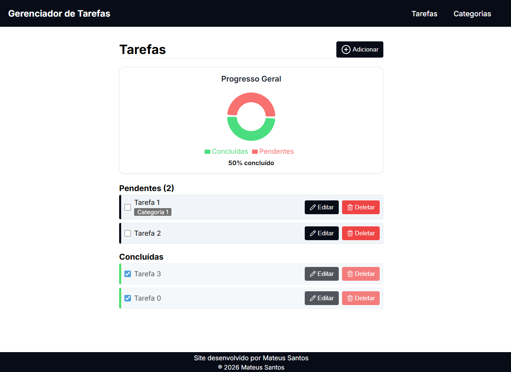

<h1 align="center">✅ Gerenciador de Tarefas ✅</h1>



---

## ℹ️ Sobre

Este projeto é uma **aplicação full-stack moderna desenvolvida com Next.js** para o **gerenciamento dinâmico de tarefas e categorias**.
O foco principal foi aplicar os recursos mais recentes do React 19 e Next.js App Router, como **Server Actions**, **Optimistic UI** (Interface Otimista) e renderização híbrida entre Server e Client Components, garantindo uma experiência de usuário fluida e performática.

#### 📍 Acesse o link: [https://gerenciador-tarefas-khaki.vercel.app/](https://gerenciador-tarefas-khaki.vercel.app/)

---

## 📋 Funcionalidades

- **Gerenciamento de Tarefas (CRUD):**
- Criação de tarefas com título e associação opcional a categorias.
- Listagem organizada entre tarefas **Pendentes** e **Concluídas**.
- Alternância de status (Check/Uncheck) com atualização em tempo real.
- Edição de detalhes e exclusão definitiva.

- **Gerenciamento de Categorias:**
- Sistema completo de categorias para organização.
- Criação, listagem, edição e exclusão de categorias.

- **Interface Otimista (Optimistic UI):**
- Exclusão e atualização de tarefas refletidas instantaneamente na interface antes mesmo da confirmação do servidor, utilizando o hook `useOptimistic`.

- **Validação Integrada:**
- Formulários protegidos com esquemas de validação rigorosos.
- Mensagens de erro em tempo real para o usuário.

- **Sincronização de Estado:**
- Uso de `revalidatePath` para garantir que os dados do servidor e do cliente estejam sempre em harmonia após mutações.

---

## 🛠️ Requisitos Técnicos

- **Server-Side Rendering (SSR):** Páginas de listagem pré-renderizadas no servidor para melhor SEO e performance.
- **Server Actions:** Toda a lógica de mutação de dados (POST, PATCH, DELETE) executada diretamente no servidor.
- **Responsividade:** Layout totalmente adaptável para dispositivos móveis e desktop usando CSS Modules.
- **Consumo de API Externa:** Integração com backend remoto via `fetch` com controle manual de cache (`no-store` e `no-cache`).

---

## 🧠 Arquitetura e Padrões Utilizados

- **Arquitetura Baseada em Features:** O projeto é dividido pelos domínios `tasks` e `categories`. Cada feature contém seus próprios componentes, schemas, hooks e serviços de API.
- **Hybrid Components:**
- **Server Components:** Utilizados para busca de dados (data fetching) e renderização inicial.
- **Client Components:** Utilizados onde há interatividade (formulários, botões de ação, hooks de estado).

- **Separação de Responsabilidades:**
- **API Layer:** Funções isoladas para comunicação com o banco de dados/json-server.
- **Schemas:** Validações centralizadas com Zod para garantir integridade tanto no formulário quanto na API.

---

## ⚛️ Hooks e Recursos do React 19 / Next.js

### Hooks e Recursos Nativos

- `useOptimistic` — Para fornecer feedback instantâneo em operações de exclusão e update.
- `useTransition` — Para gerenciar estados de pendência (`isPending`) durante chamadas assíncronas ao servidor.
- `useForm` — Gerenciamento de formulários com integração de schema.
- `useRouter` & `useSearchParams` — Navegação programática e manipulação de estado via URL.

### Recursos de Servidor

- `"use server"` — Server Actions para manipulação de dados segura.
- `revalidatePath` — Invalidação de cache sob demanda para atualização da UI.
- `forwardRef` — Utilizado em componentes de UI reutilizáveis (Input, Select) para integração perfeita com bibliotecas de formulário.

---

## 🧾 Validação de Formulários

- **`React Hook Form`** para controle de inputs.
- **`Zod`** para definição de contratos de dados (Schemas).
- **Vantagens aplicadas:**
- Prevenção de submissão de dados inválidos.
- Tipagem estática compartilhada entre o formulário e a resposta da API.

---

## 🔔 Feedback e Notificações

A aplicação utiliza a biblioteca **Sonner** para fornecer feedback imediato e elegante sobre as ações do usuário. Os toasts foram implementados em fluxos críticos:

- **Confirmação de Sucesso:** Notificações disparadas após a criação, edição ou exclusão bem-sucedida de tarefas e categorias.
- **Tratamento de Erros:** Alertas visuais claros caso uma **Server Action** falhe ou ocorra um erro de conexão com a API.
- **Estados de Transição:** Integração com `useTransition` para garantir que o toast de sucesso só apareça após a confirmação final do servidor, mesmo em fluxos com interface otimista.

---

## 📊 Visualização de Dados e Progresso

Para elevar a experiência de gestão, a aplicação conta com um dashboard visual dinâmico:

- **Gráfico de Rosca (Donut Chart):** Implementado com a biblioteca **Recharts**, oferecendo uma visão clara da distribuição entre tarefas pendentes e concluídas.
- **Sincronização Otimista:** O gráfico não depende de um "reload" da página. Graças ao uso de `useOptimistic` e `router.refresh()`, ao marcar uma tarefa como concluída, a fatia do gráfico e a porcentagem se movem instantaneamente.
- **Feedback Numérico:** Exibição da porcentagem real de progresso calculada dinamicamente com base no estado atual da lista.
- **UI Customizada:** Tooltips e legendas estilizadas para manter a consistência visual.

---

## 📁 Estrutura de Pastas

```text
src
 ┣ app (Rotas e Páginas)
 ┃ ┣ categories
 ┃ ┗ tasks
 ┣ features (Lógica de Domínio)
 ┃ ┣ categories
 ┃ ┃ ┣ api, components, schemas
 ┃ ┗ tasks
 ┃ ┃ ┣ api, components, schemas
 ┣ components (UI Global Reutilizável)
 ┃ ┣ Button, Input, Select, HeaderSection
 ┣ env.ts (Validação de variáveis de ambiente)
 ┣ styles (Estilos globais)

```

## 🚀 Tecnologias Utilizadas

- **Next.js 16+** (App Router & Server Actions)
- **React 19** (Hooks: `useOptimistic`, `useTransition`, `useForm`)
- **TypeScript** (Tipagem estática em toda a aplicação)
- **Zod** (Validação de schemas e contratos de dados)
- **React Hook Form** (Gestão performática de formulários)
- **Sonner** (Sistema de notificações toast)
- **Recharts** (Visualização de Dados)
- **Data Visualization Concepts** (Cálculo de métricas em tempo real)
- **CSS Modules** (Estilização escopada e modular)
- **JSON Server** (Backend Mock para persistência de dados)

---

## 📄 Licença

Este projeto está sob a licença **MIT**.
